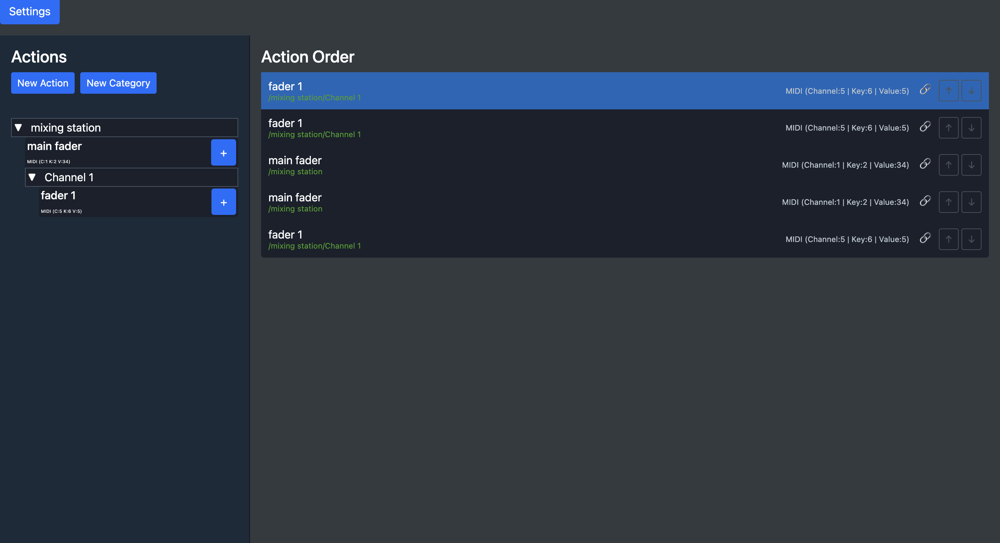
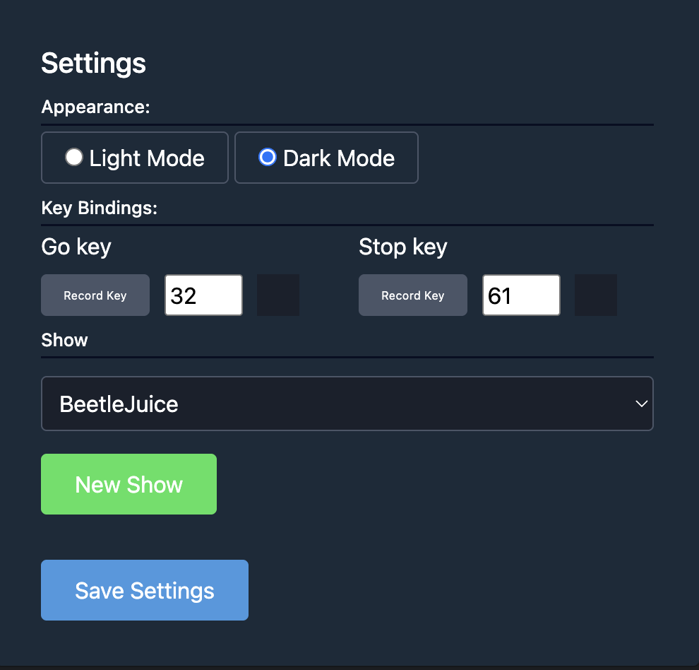

# Midi Theatre

Welcome to the Midi Theatre project. This project uses MIDI files to drive live theatre productions, enabling creative control over stage lighting, sound, and effects. The idea is a simple clean interface that allows reordering and multi-midi sequences.

## Features

- Parsing and manipulating MIDI files.
- Real-time control over theatre effects.
- Integration with hardware and digital lighting systems.
- Highly customizable and extendable design.

## Interface example:



- The interface is a simple click and add interface that allows the user to reorder and sequence MIDI signals.
- on the left, the user can add MIDI commands to the bank of commands including folders.
- on the right, the user can sequence the commands in the order they want them

## Midi Theatre Interface Settings:



- The settings allow the user to set the Shortcuts for the interface.
- The user can also set the Show and add a new show.

## Installation

1. Clone the repository:

    ```bash
    git clone https://github.com/username/midiTheatre.git
    ```

2. Navigate to the project directory:

    ```bash
    cd midiTheatre
    ```

3. Install required dependencies:

    ```bash
    poetry install
    ```

4. Run the django server:

    ```bash
    python manage.py runserver
    ```

## Contributing

Pull requests are welcome. For major changes, please open an issue first to discuss what you would like to change.

## License

This project is licensed under the MIT License.
